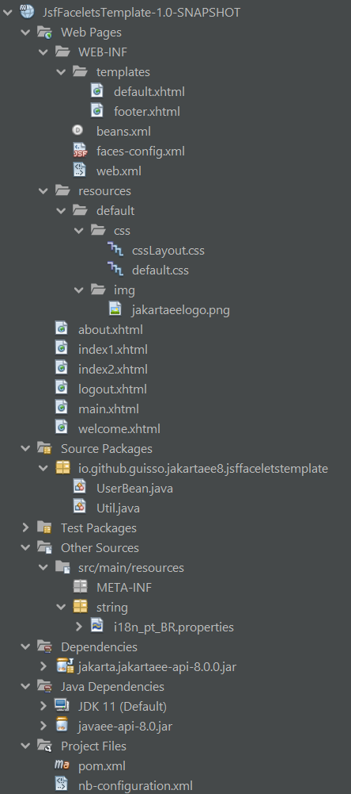

# JsfFaceletsTemplate

A Jakarta EE Web Application with a JSF Template example, EL evaluation by managed bean and parametrized I18N.

## Suggested analysis order

1. [web.xml](/src/main/webapp/WEB-INF/web.xml)
2. [faces-config.xml](/src/main/webapp/WEB-INF/faces-config.xml)
3. [i18n_pt_BR.properties](/src/main/resources/string/i18n_pt_BR.properties)
4. [UserBean.java](/src/main/java/io/github/guisso/jakartaee8/jsffaceletstemplate/UserBean.java)
5. [Util.java](/src/main/java/io/github/guisso/jakartaee8/jsffaceletstemplate/Util.java)
6. [default.xhtml](/src/main/webapp/WEB-INF/templates/default.xhtml)
7. [footer.xhtml](/src/main/webapp/WEB-INF/templates/footer.xhtml)
8. [resources/default](/src/main/webapp/resources/default)
9. [welcome.xhtml](/src/main/webapp/welcome.xhtml)
10. [main.xhtml](/src/main/webapp/main.xhtml)
11. [about.xhtml](/src/main/webapp/about.xhtml)
12. [index1.xhtml](/src/main/webapp/index1.xhtml)
13. [index2.xhtml](/src/main/webapp/index2.xhtml)
14. [logout.xhtml](/src/main/webapp/logout.xhtml)

## Reference

<https://eclipse-ee4j.github.io/jakartaee-tutorial/toc.html>
